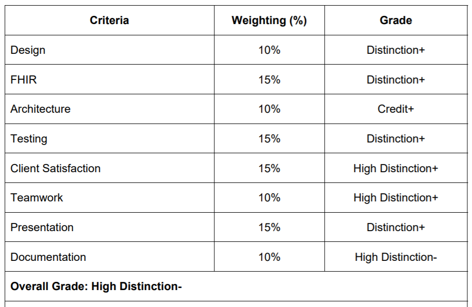

# Chronic Disease Prevention web app

## Documentation 
https://github.com/NicoleTYF/UniProject-ChronicDisease/blob/main/Documentation_version_3%20(1).pdf

&emsp; **My role in this project:**  
&emsp; ✍️ Gather client requirements, discuss requirements with developers  
&emsp; 📈 Modelling system flow, interraction and database design for the solution  
&emsp; 🔬 Conduct UX research for user interface  
&emsp; 🖼️ Annotate prototypes to document iteration processes based on client and end-user feedback  
&emsp; 📝 Document Weekly Meeting Logs for team and client communication  
&emsp; 📃 Write and organise documentation contents except Testing section  

 

## Feedback 

* Overall, the document looks great and is well structured with very few spelling and grammatical errors. 
* The design demonstrates extensive application of knowledge and skills. The interface is appropriate for its purpose
and a clear iteration process has been documented. 
* The project's artefacts have been suitably organised. 
* In the document both functional and non-functional testing has been conducted and documented. It is clear that the results are being analysed and used for iterations and changes. To be improved would be to structure this section better, start off by letting the reader know how many test subjects there are in total (not just SUS) and are they the same ones used for Think-Aloud. Even more detailed and focused functional testing could have been conducted. 
* Teamwork has been managed beautifully even though I can read that there have been considerable challenges. 
* Meeting logs and reflections are well written. 
* Given the complexity of the application, client was very impressed with what this team has achieved 
